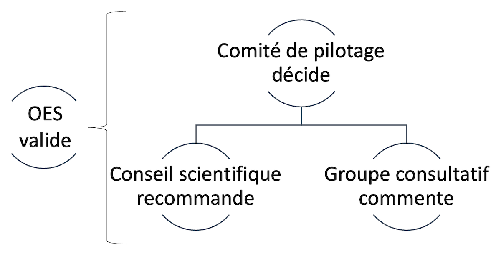

```{r setup, include=FALSE}
options(htmltools.dir.version = FALSE)
knitr::opts_chunk$set(
  fig.width = 9, fig.height = 3.5, fig.retina = 3,
  out.width = "100%",
  cache = FALSE,
  echo = TRUE,
  message = FALSE,
  warning = FALSE,
  fig.show = TRUE,
  hiline = TRUE
)
```

```{r xaringan-themer, include=FALSE, warning=FALSE}
library(xaringanthemer)
style_duo_accent(
  primary_color = "#D2202B",
  secondary_color = "#D2202B",
  inverse_header_color = "#FFFFFF",
  link_color = "#676C72",
    header_font_google = google_font("Josefin Sans")

)
```

class: title-slide, inverse, bottom
background-image: url(`r rmarkdown::metadata$url_unsplash`)
background-size: cover

# `r rmarkdown::metadata$title`

## `r rmarkdown::metadata$subtitle`

### `r rmarkdown::metadata$team`

### `r rmarkdown::metadata$date`

---
class: about-me, middle, center


## Formation continue HEP-VS

[`r icons::fontawesome("link")` `r basename(rmarkdown::metadata$url_website)`](`r rmarkdown::metadata$url_website`)</br>
[`r icons::fontawesome("user-lock")` Stockage du projet (RII)](`r rmarkdown::metadata$url_intranet`)
---
class: inverse, middle left

# Ordre du jour

--

- Rappel du contexte

--

- Fiches projets
  - Présentation des 2 fiches projets
  - Etat d’avancement
  - Echéancier
  - Enjeux financiers
  
--

- Partenariat interinstitutionnel
  - IPC de l'UNIFR
  - FernUni

--

- Décisions

--

- Divers, suite

---
class: middle left

# Rappel du contexte

--

### Mandat

Client : Office de l'Enseignement Spécialisé (dépendant du Service de l'Enseignement)

Formation de 44 heures réparties en 4 parties (ou modules) 

Contenus : TSA, troubles et neurosciences, compétences psychosociales, connaissance d'outils

--

### Autonomie des personnes

3 sessions de août 2022 à juin 2024

Utilisation des technologies : Teams (enseignement comodal), Moodle HEP-VS 

--

### Alternance théorie-pratique forte

Contenus académiques et connexion avec la culture d'établissement

---
class: middle left

# Rappel du contexte : Affaires courantes

--

.pull-left[

- Organes formalisés: comité de pilotage, conseil scientifique, groupe consultatif

- Montée en puissance: attribution de ressources internes

- Rédaction "procédure d'inscriptions et masse critique" (en cours)

- Rédaction "cours accéléré pour les futur·es engagé·es" (en cours)

- Rédaction "connexions avec le MAES Bas-Valais" (en cours)

]

--

.pull-right[

- Élaboration d'un cadre de fonctionnement avec les institutions partenaires pressenties

- Identité de la formation: nom, visuels

- Réflexions sur la possibilité de formaliser la formation

- Formalisation de l'organigramme (pouvoir décisionnel)

]


---
class: middle, center

```{r org, echo=FALSE, message=TRUE, warning=TRUE, out.width='75%', paged.print=FALSE}
# local

```

---

class: inverse, middle left

# Présentation des 2 fiches de projets

--

## Etat d’avancement

--

## Echéancier

- Septembre 2021: Validation financière du projet, validation du concept de formation &#x1f7e0;

- Octobre 2021: Démarrage des organes de formation 1.12 (CS) ;  6.12 (GC) ; 10.01 (CS) ; 11.01 (GC) &#x1F7E2;

- Janvier 2022: Validation des équipes de formation &#x1f7e0;

- Février 2022: Validation de la première communication aux ES par l'OES sur proposition de la HEP-VS &#x1f7e0;

--

## Enjeux financiers


---
class: middle left, inverse

# Partenariat interinstitutionnel


--

## IPC (UNFIR)

--

## UniDistance

--

## Enjeux : 

- Place dans le comité de pilotage
- Rôle décisionnel
- Nécessité d'une convention

---

class: middle left

# Décisions

--

## Go / No Go financier

--

## Go / No Go pour le partenariat institutionnel

- Go / No Go de principe de la DIR HEP-VS

- Négociation de la convention par DIR ou UFA (deadline : 15 janvier 2022)

---

class: middle left

# Divers

---

class: middle,  

## Merci pour ton attention!


```{r out.width = '10%', echo=FALSE}
# local
knitr::include_graphics("img/logo.png")
```
